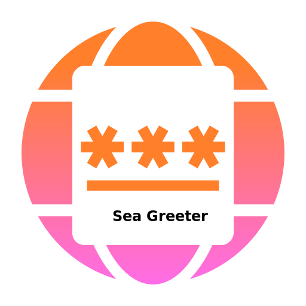

<div align="center">
  <a>
    
  </a>
  <h1><strong>Sea Greeter</strong></h1>
  <p>
    <strong>Another LightDM greeter made with WebKitGTK2</strong>
  </p>
  <p>
    <a href="#">
      
    </a>
  </p>
</div>

Sea (like C) greeter for LightDM allows to create themes with web technologies,
the same as [web-greeter][web-greeter], [nody-greeter][nody-greeter] and the
outdated [lightdm-webkit2-greeter][webkit2-greeter]. This project aims to be
similar to the last one, as sea-greeter is made with webkit2 instead of chromium.

## Known issues

There are lots of issues, even not documented here, so it is not recommended to use this greeter yet.
However, it is functional :D

- [x] Multi-monitor support.
    - [x] Add `greeter_comm` JavaScript API
    - [x] Parse `index.yml` to load `secondary.html`
- [ ] Brightness feature support
- [ ] Battery feature support
- [x] Detect theme errors prompt
- [x] Memory management might not be correct; possible memory leaks. (I hope this is fixed)
- [x] Add themes
- [x] Add config

## Dependencies

- libgtk3
- webkit2gtk
- libwebkit2gtk-web-extension
- libyaml-0.1
- libglib-2.0
- liblightdm-gobject-1-dev

### Build dependencies

- Meson
- Ninja
- gcc
- tsc (TypeScript compiler)

## Build and install

```sh
git clone https://github.com/JezerM/sea-greeter --recursive
cd sea-greeter
meson build
ninja -C build
sudo ninja -C build install
```

[web-greeter]: https://github.com/JezerM/web-greeter "Web Greeter"
[nody-greeter]: https://github.com/JezerM/nody-greeter "Nody Greeter"
[webkit2-greeter]: https://github.com/Antergos/web-greeter/tree/stable "LightDM WebKit2 Greeter"
